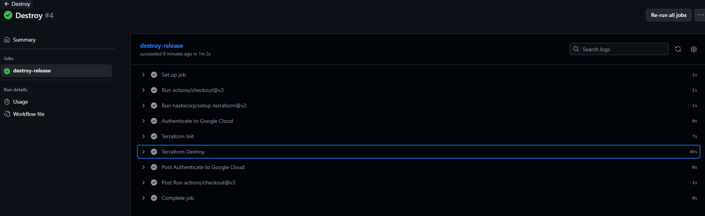
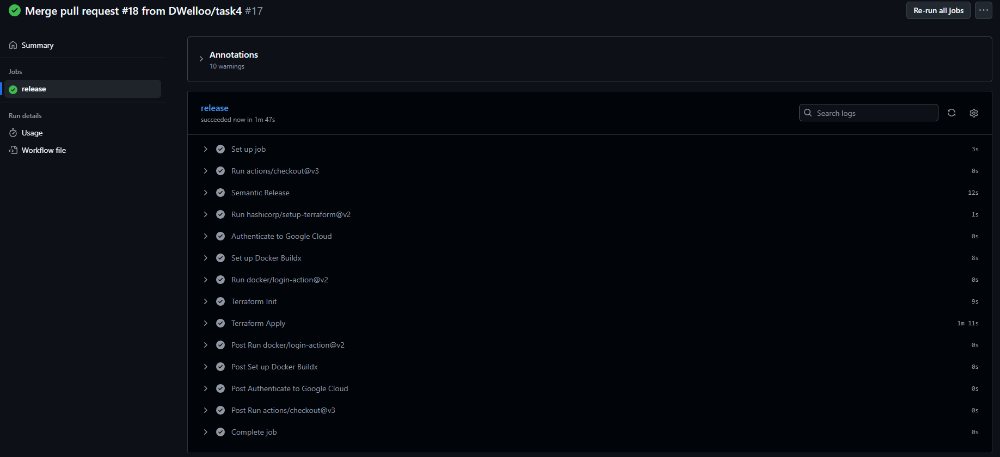
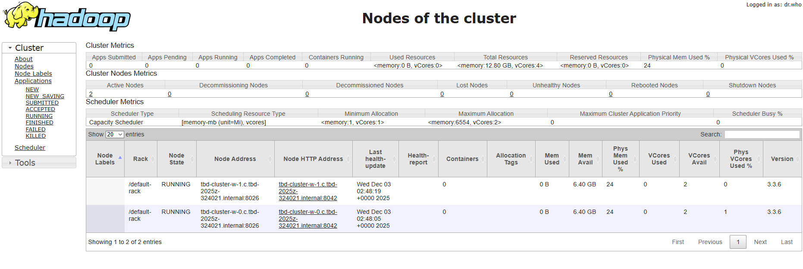

IMPORTANT ❗ ❗ ❗ Please remember to destroy all the resources after each work session. You can recreate infrastructure by creating new PR and merging it to master.
  


1. Authors:

   ***enter your group nr***
   z7

   ***link to forked repo***
   https://github.com/DWelloo/tbd-workshop-1
   
2. Follow all steps in README.md.

3. From avaialble Github Actions select and run destroy on main branch.
A

   
4. Create new git branch and:
    1. Modify tasks-phase1.md file.
    
    2. Create PR from this branch to **YOUR** master and merge it to make new release. 
    
    ***place the screenshot from GA after succesfull application of release***
    

5. Analyze terraform code. Play with terraform plan, terraform graph to investigate different modules.

    ## Dataproc module description

    - Creates a dedicated **service account** for Dataproc.  
    This account is used by all cluster VMs to run Spark jobs and access GCP resources.
    Assigned roles:
    - **roles/dataproc.worker** — allows VMs inside the cluster to act as Dataproc workers  
    - **roles/bigquery.dataEditor** — enables reading/writing BigQuery tables from jobs  
    - **roles/bigquery.user** — allows querying BigQuery  
    - **roles/iam.serviceAccountUser** — required for Dataproc to impersonate the service account

    - Enables the API:
    - **dataproc.googleapis.com** — activates the managed Hadoop/Spark service in the project

    - Creates two GCS buckets required by Dataproc:
    - **staging bucket** — used to store job code, JAR files, Python scripts, and metadata  
    - **temp bucket** — used for temporary shuffle data created during Spark jobs  
    Dataproc will not start without both buckets.

    - Grants bucket-level IAM permissions to the Dataproc service account:
    - **staging_bucket_iam** — allows uploading job files and reading results  
    - **temp_bucket_iam** — allows writing intermediate Spark/Hadoop data

    - Creates a Dataproc cluster configured with:
    - subnet provided as input (cluster is placed in private VPC)
    - default machine type `e2-medium` for master/worker nodes (configurable)
    - image version `2.2.69-ubuntu22` (Ubuntu-based Dataproc runtime)
    - service account and buckets created in this module
    This results in a fully working Dataproc environment ready to run Spark jobs.

    **Outputs:**
    - **Dataproc cluster name** — used by other modules (e.g., job submission or monitoring)

    **Terraform graph output**
    ```
    digraph {
        compound = "true"
        newrank = "true"
        subgraph "root" {
                "[root] google_dataproc_cluster.tbd-dataproc-cluster" [label = "google_dataproc_cluster.tbd-dataproc-cluster", shape = "box"]
                "[root] google_dataproc_cluster.tbd-dataproc-cluster (expand)" [label = "google_dataproc_cluster.tbd-dataproc-cluster", shape = "box"]
                "[root] google_project_iam_member.dataproc_bigquery_data_editor" [label = "google_project_iam_member.dataproc_bigquery_data_editor", shape = "box"]
                "[root] google_project_iam_member.dataproc_bigquery_data_editor (expand)" [label = "google_project_iam_member.dataproc_bigquery_data_editor", shape = "box"]
                "[root] google_project_iam_member.dataproc_bigquery_user" [label = "google_project_iam_member.dataproc_bigquery_user", shape = "box"]
                "[root] google_project_iam_member.dataproc_bigquery_user (expand)" [label = "google_project_iam_member.dataproc_bigquery_user", shape = "box"]
                "[root] google_project_iam_member.dataproc_worker" [label = "google_project_iam_member.dataproc_worker", shape = "box"]
                "[root] google_project_iam_member.dataproc_worker (expand)" [label = "google_project_iam_member.dataproc_worker", shape = "box"]
                "[root] google_project_service.dataproc" [label = "google_project_service.dataproc", shape = "box"]
                "[root] google_project_service.dataproc (expand)" [label = "google_project_service.dataproc", shape = "box"]
                "[root] google_service_account.dataproc_sa" [label = "google_service_account.dataproc_sa", shape = "box"]
                "[root] google_service_account.dataproc_sa (expand)" [label = "google_service_account.dataproc_sa", shape = "box"]
                "[root] google_storage_bucket.dataproc_staging" [label = "google_storage_bucket.dataproc_staging", shape = "box"]
                "[root] google_storage_bucket.dataproc_staging (expand)" [label = "google_storage_bucket.dataproc_staging", shape = "box"]
                "[root] google_storage_bucket.dataproc_temp" [label = "google_storage_bucket.dataproc_temp", shape = "box"]
                "[root] google_storage_bucket.dataproc_temp (expand)" [label = "google_storage_bucket.dataproc_temp", shape = "box"]
                "[root] google_storage_bucket_iam_member.staging_bucket_iam" [label = "google_storage_bucket_iam_member.staging_bucket_iam", shape = "box"]
                "[root] google_storage_bucket_iam_member.staging_bucket_iam (expand)" [label = "google_storage_bucket_iam_member.staging_bucket_iam", shape = "box"]
                "[root] google_storage_bucket_iam_member.temp_bucket_iam" [label = "google_storage_bucket_iam_member.temp_bucket_iam", shape = "box"]
                "[root] google_storage_bucket_iam_member.temp_bucket_iam (expand)" [label = "google_storage_bucket_iam_member.temp_bucket_iam", shape = "box"]
                "[root] provider[\"registry.terraform.io/hashicorp/google\"]" [label = "provider[\"registry.terraform.io/hashicorp/google\"]", shape = "diamond"]
                "[root] var.image_version" [label = "var.image_version", shape = "note"]
                "[root] var.machine_type" [label = "var.machine_type", shape = "note"]
                "[root] var.project_name" [label = "var.project_name", shape = "note"]
                "[root] var.region" [label = "var.region", shape = "note"]
                "[root] var.subnet" [label = "var.subnet", shape = "note"]
                "[root] google_dataproc_cluster.tbd-dataproc-cluster (expand)" -> "[root] google_project_iam_member.dataproc_bigquery_data_editor"
                "[root] google_dataproc_cluster.tbd-dataproc-cluster (expand)" -> "[root] google_project_iam_member.dataproc_bigquery_user"
                "[root] google_dataproc_cluster.tbd-dataproc-cluster (expand)" -> "[root] google_project_iam_member.dataproc_worker"
                "[root] google_dataproc_cluster.tbd-dataproc-cluster (expand)" -> "[root] google_project_service.dataproc"
                "[root] google_dataproc_cluster.tbd-dataproc-cluster (expand)" -> "[root] google_storage_bucket_iam_member.staging_bucket_iam"
                "[root] google_dataproc_cluster.tbd-dataproc-cluster (expand)" -> "[root] google_storage_bucket_iam_member.temp_bucket_iam"
                "[root] google_dataproc_cluster.tbd-dataproc-cluster (expand)" -> "[root] var.image_version"
                "[root] google_dataproc_cluster.tbd-dataproc-cluster (expand)" -> "[root] var.machine_type"
                "[root] google_dataproc_cluster.tbd-dataproc-cluster (expand)" -> "[root] var.subnet"
                "[root] google_dataproc_cluster.tbd-dataproc-cluster" -> "[root] google_dataproc_cluster.tbd-dataproc-cluster (expand)"
                "[root] google_project_iam_member.dataproc_bigquery_data_editor (expand)" -> "[root] google_service_account.dataproc_sa"
                "[root] google_project_iam_member.dataproc_bigquery_data_editor" -> "[root] google_project_iam_member.dataproc_bigquery_data_editor (expand)"
                "[root] google_project_iam_member.dataproc_bigquery_user (expand)" -> "[root] google_service_account.dataproc_sa"
                "[root] google_project_iam_member.dataproc_bigquery_user" -> "[root] google_project_iam_member.dataproc_bigquery_user (expand)"
                "[root] google_project_iam_member.dataproc_worker (expand)" -> "[root] google_service_account.dataproc_sa"
                "[root] google_project_iam_member.dataproc_worker" -> "[root] google_project_iam_member.dataproc_worker (expand)"
                "[root] google_project_service.dataproc (expand)" -> "[root] provider[\"registry.terraform.io/hashicorp/google\"]"
                "[root] google_project_service.dataproc (expand)" -> "[root] var.project_name"
                "[root] google_project_service.dataproc" -> "[root] google_project_service.dataproc (expand)"
                "[root] google_service_account.dataproc_sa (expand)" -> "[root] provider[\"registry.terraform.io/hashicorp/google\"]"
                "[root] google_service_account.dataproc_sa (expand)" -> "[root] var.project_name"
                "[root] google_service_account.dataproc_sa" -> "[root] google_service_account.dataproc_sa (expand)"
                "[root] google_storage_bucket.dataproc_staging (expand)" -> "[root] provider[\"registry.terraform.io/hashicorp/google\"]"
                "[root] google_storage_bucket.dataproc_staging (expand)" -> "[root] var.project_name"
                "[root] google_storage_bucket.dataproc_staging (expand)" -> "[root] var.region"
                "[root] google_storage_bucket.dataproc_staging" -> "[root] google_storage_bucket.dataproc_staging (expand)"
                "[root] google_storage_bucket.dataproc_temp (expand)" -> "[root] provider[\"registry.terraform.io/hashicorp/google\"]"
                "[root] google_storage_bucket.dataproc_temp (expand)" -> "[root] var.project_name"
                "[root] google_storage_bucket.dataproc_temp (expand)" -> "[root] var.region"
                "[root] google_storage_bucket.dataproc_temp" -> "[root] google_storage_bucket.dataproc_temp (expand)"
                "[root] google_storage_bucket_iam_member.staging_bucket_iam (expand)" -> "[root] google_service_account.dataproc_sa"
                "[root] google_storage_bucket_iam_member.staging_bucket_iam (expand)" -> "[root] google_storage_bucket.dataproc_staging"
                "[root] google_storage_bucket_iam_member.staging_bucket_iam" -> "[root] google_storage_bucket_iam_member.staging_bucket_iam (expand)"
                "[root] google_storage_bucket_iam_member.temp_bucket_iam (expand)" -> "[root] google_service_account.dataproc_sa"
                "[root] google_storage_bucket_iam_member.temp_bucket_iam (expand)" -> "[root] google_storage_bucket.dataproc_temp"
                "[root] google_storage_bucket_iam_member.temp_bucket_iam" -> "[root] google_storage_bucket_iam_member.temp_bucket_iam (expand)"
                "[root] output.dataproc_cluster_name (expand)" -> "[root] google_dataproc_cluster.tbd-dataproc-cluster"
                "[root] provider[\"registry.terraform.io/hashicorp/google\"] (close)" -> "[root] google_dataproc_cluster.tbd-dataproc-cluster"
                "[root] root" -> "[root] output.dataproc_cluster_name (expand)"
                "[root] root" -> "[root] provider[\"registry.terraform.io/hashicorp/google\"] (close)"
        }
    }```


    ***describe one selected module and put the output of terraform graph for this module here***
   
6. Reach YARN UI
   Command: `gcloud compute ssh tbd-cluster-m --project=tbd-2025z-324021 --zone=europe-west1-b -- -N -L 8088:localhost:8088`
   and then connect to `http://localhost:8088/cluster/nodes`
   
   ***place the command you used for setting up the tunnel, the port and the screenshot of YARN UI here***
   
7. Draw an architecture diagram (e.g. in draw.io) that includes:
    1. Description of the components of service accounts
    2. List of buckets for disposal
    
    ***place your diagram here***

8. Create a new PR and add costs by entering the expected consumption into Infracost
For all the resources of type: `google_artifact_registry`, `google_storage_bucket`, `google_service_networking_connection`
create a sample usage profiles and add it to the Infracost task in CI/CD pipeline. Usage file [example](https://github.com/infracost/infracost/blob/master/infracost-usage-example.yml) 

   ***place the expected consumption you entered here***

   ***place the screenshot from infracost output here***

9. Create a BigQuery dataset and an external table using SQL
    
    ***place the code and output here***
   
    ***why does ORC not require a table schema?***

10. Find and correct the error in spark-job.py

    ***describe the cause and how to find the error***

11. Add support for preemptible/spot instances in a Dataproc cluster

    ***place the link to the modified file and inserted terraform code***
    
12. Triggered Terraform Destroy on Schedule or After PR Merge. Goal: make sure we never forget to clean up resources and burn money.

Add a new GitHub Actions workflow that:
  1. runs terraform destroy -auto-approve
  2. triggers automatically:
   
   a) on a fixed schedule (e.g. every day at 20:00 UTC)
   
   b) when a PR is merged to main containing [CLEANUP] tag in title

Steps:
  1. Create file .github/workflows/auto-destroy.yml
  2. Configure it to authenticate and destroy Terraform resources
  3. Test the trigger (schedule or cleanup-tagged PR)
     
***paste workflow YAML here***

***paste screenshot/log snippet confirming the auto-destroy ran***

***write one sentence why scheduling cleanup helps in this workshop***
